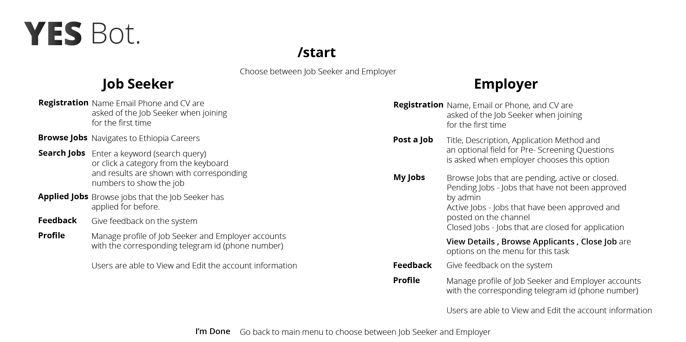
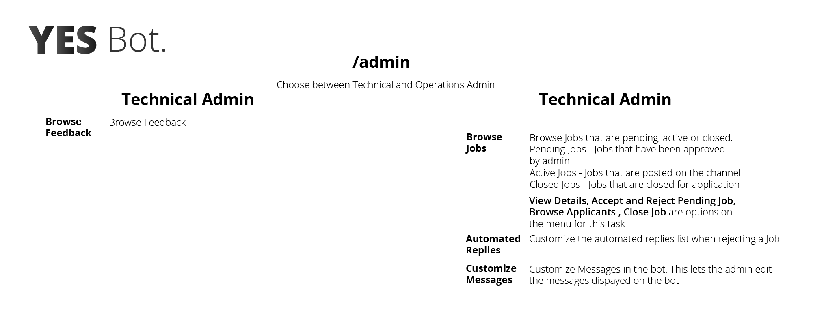

# Yes Telegram Bot

Yes telegram bot is a job portal for job seekers and employers to browser and post jobs.

## Getting Started

'node index.js' can be used to run the project.
Alternatively you can use 'npm start'.

### Prerequisites

An environment with Node Js installed.

## Built With

* [Telegraf](telegraf.js.org) - The telegram library used
* [Telegram-Session-Local](https://www.npmjs.com/package/telegraf-session-local) - Middleware for locally stored sessions & database
* [Express](https://expressjs.com/) - Used to check if the app is running on the server.

## Authors

* **Buruk Sahilu** - *Initial work* - [bre10000](https://github.com/bre10000)
* **Yilikal Mulugeta** - *Additional Features*

# Code Details

## index.js

This is where the commands, callback_queries and text replies are handled. 

The channel to be posted on and the bot can all be changed here. Details are provided below.

* const app = new Telegraf('1030576944:AAEgABxuJs3dQTTEU7EMKhgYiemx9Vw8qyI')
  This is the bot id. You can create a new bot and replace it here. To create a new bot visit https://telegram.me/BotFather
* channel_id & channel_chat_id
  this is the channel id of Ethiopia careers. This is where the a job gets posted when its approved.
* admin_pass & admin_operations_pass
  these are the passwords for the Technical and Operations admin respectively

## buttons.js

This is where the buttons sent underneath the messages are located.

## keyboard.js

This is where the keyboards are located.

## databaseConnection.js

Establishes database connection and sets up initial values for the UI messages.

## databaseFunctions.js

All database related functions like fetching and reading data are located here.

## yes_db.json

The database file

# Features and Flow

